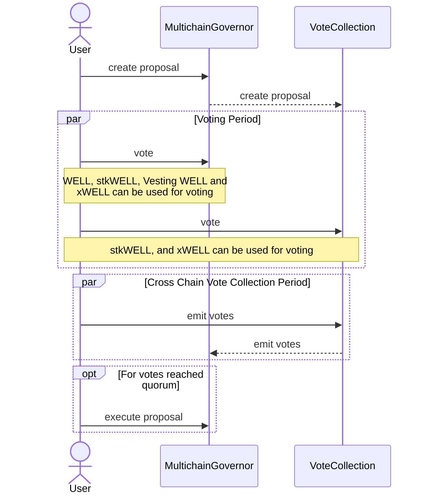
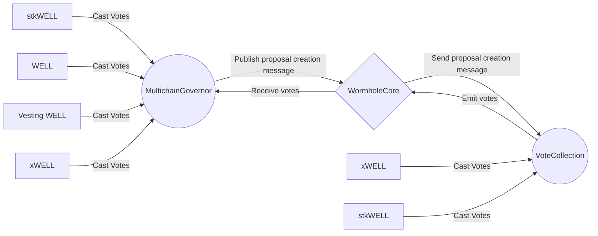

# Multichain Governance

The Multichain Governance allows voting on all networks where Moonwell is
active, like Moonbeam and Base. Its main objective is to execute proposals on
Moonbeam, and if they have a cross-chain nature, their payload will be relayed
to another chain for execution by the Temporal Governor.

There are two main components in the Multichain Governor architecture:

1. [Multichain Governor](./contracts/MULTICHAINGOVERNOR.md): The main contract
   deployed on Moonbeam that handles the creation, voting, and execution of
   proposals.
2. [Vote Collection](./contracts/VOTECOLLECTION.md): The contract that handles
   the collection of votes from external chains and emits them to the Governor
   contract.

Once the voting period ends, external chain votes can be emitted by anyone to be
counted on the Moonbeam Governance Contract. The Governor contract will validate
it and update the vote counts accordingly. After the cross chain voting
collection period ends and if proposal passes, it can be executed by anyone.

Multichain Governance relies on the Wormhole bridge to relay the proposal
creation and vote collection messages to the external chains.

## Cross Chain Voting

The new governance period system removes the need for the queue function, as the
different periods are measured based on the proposal creation timestamp.
Proposals are automatically queued if the cross-chain vote collection period
ends, and it meets the success criteria. Any additional vote counts received
between the voting period end and proposal execution time could modify the
success status to failure, which would block execution.

Once the cross-chain vote collection time execution time has been reached, no
more votes can be submitted, and the proposal status is final. If passed, it can
be executed. If failed, it cannot. Votes can only be counted before the final
execution time, not after. This means that if enough no votes from an external
chain are recorded one second before a proposal would pass, the proposal could
become either failed or succeeded from its previous state.

## Proposal Status

A proposal can be any of the following status:

- Active: This means that the proposal is currently in the voting period.
- CrossChainVoteCollection: THe voting period has ended, and the proposal is now
  waiting for cross-chain votes.
- Cancelled: The proposer has canceled or anyone can cancel if the proposer
  voting power has become lower than the minimum proposal threshold.
- Defeated: The proposal has been defeated, the amount of against votes plus the
  amount of abstain votes is higher or equal than governance quorum.
- Succeeded: The proposal has passed, the amount of for votes plus the amount of
  abstain votes is higher than governance quorum.
- Executed: The proposal has been executed. If the proposal is cross-chain, the
  payload will be relayed to the Temporal Governor for execution on the target
  chain.

## Execution

The execution of a proposal can be done by anyone, and it will be done by
calling the `execute` function on the Governor contract. This function will
check if the proposal has passed and if it has not been executed yet. If the
proposal is cross-chain, a VAA will be generated by Wormhole which can be queued
and executed on the Temporal Governor of the target chain.
