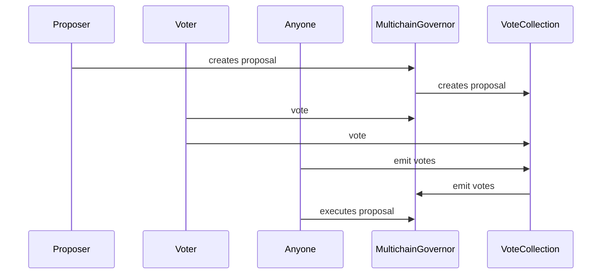

# Multichain Governor

Multichain Governor is live on Moonbeam. The Multichain Governor is where the
proposals are created and executed.

## Overview

The Moonbeam governor contract serves as the source of truth for all governance
actions in Moonwell. Whenever a new proposal is created, it will send out a
message that will be transmitted to the voting contracts of destination chains.
This will empower WELL and stkWELL holders to participate in the voting process
on proposals that are going to go live on Moonbeam. The Multiwell proposals
framework is designed to work cross-chain, which implies that proposals that are
active on Moonbeam can have an impact on the system's state on other chains.

## Architecture

## Governance Parameters Configuration

- `votingPeriod`: The time period in seconds that the governor will collect
  votes for a proposal.
- `crossChainVoeCollectionPeriod`: The time period in seconds that the governor
  will collect votes for a proposal before it is executed and after the voting
  period has ended.
- `quorum`: The minimum percentage of votes required for a proposal to pass.
- `proposalThreshold`: The minimum number of votes required for a proposal to be
  created.

Only the Governance contract can change these parameters. This implies that a
proposal must be created and passed to update these parameters.

## Permissionless Actions

### Create Proposal

Any address can create a proposal by calling the `createProposal` function if
they have at least the voting power threshold required to create a proposal. The
proposer must provide the following parameters:

- `targets`: An array of addresses to call
- `values`: An array of values to pass to the calls
- `calldatas`: An array of calldatas to pass to the calls
- `description`: A string describing the proposal

### Vote

Any address can vote on a proposal by calling the `castVote` function. Users can
vote `for`, `against`, or `abstain` on a proposal.

The following tokens are used for voting:

- WELL: The Moonwell token
- Staked WELL: The staked token for Moonwell
- xWELL: The bridged token for Moonwell
- Vesting WELL: Vesting WELL locked in the claimable contract

The caller must provide the following parameters:

- `proposalId`: The id of the proposal to vote on
- `voteValue`: The vote value to cast. `0` for against, `1` for for, `2` for
  abstain.

### Execute Proposal

Any address can execute a proposal by calling the `execute` function. The
proposal must have passed the cross chain voting colleciton period and have
enough for votes to be executed. The caller must provide the following
parameter:

- `proposalId`: The id of the proposal to execute

If the proposal is cross-chain, a VAA will be generated by Wormhole which can be
queued and executed on the Temporal Governor of the target chain.

### Rebroadcast Proposal

Any address can rebroadcast a proposal by calling the `rebroadcastProposal`.
This function is useful in case the wormhole relayer or wormhole core contract
is paused. Can only be called if the proposal is in the active state.

### Cancel

Any caller can cancel a proposal by calling the `cancel` function if the
proposer voting power has drops below threshold. Otherwise, only the proposer
can cancel the propsal.

## Guardian Actions

There are only two roles with permissions on the Governor contract. The
`Pause Guardian` and the `Break Glass Guardian`. Anytime a role is used, they
can only be used once, and then their roles are revoked once the action is
completed.

### Pause Guardian

The Pause Guardian can pause the Governor contract, which will prevent any new
proposals from being created, any votes from being cast and any proposals from
being executed. Pause also cancel any active proposals. After the pause
duration, the governor will automatically unpause, thus not allowing the pause
guardian to brick the governor. The pause guardian will only be able to pause
once, and then the governor will need to grant the pausing ability again.

### Break Glass Guardian

The break glass guardian is able to propose and execute a governance proposal
that calls any address with the following set of whitelisted calldatas:

- transferOwnership to Artemis Timelock
- setPendingAdmin to Artemis Timelock
- setEmissionManager to Artemis Timelock (Used for stake token emission)
- changeAdmin to Artemis Timelock
- wormholeCore publish message to Temporal Governor that grants Artemis Timelock
  governor ability

No checks will be performed as to which contracts are being called, and
addresses are the only parameter the break glass guardian can specify without
sanitization. The calldata they pass must be an exact match of one of the
calldatas specified above, otherwise the entire transaction will revert.

## View Only Functions

- `getReceipt`: Returns the vote receipt of a voter for a proposal
- `proposalInformation`: Returns the proposal information for a given proposal
  id. Includes the proposer, vote snapshot timestmap, vote start timestamp, vote
  end timestamp, corss chain vote collection end timestamp, for votes, against
  votes and abstain votes.
- `proposalVotes`: Returns the vote count for a proposal
- `getProposalData`: Returns the targets, values and calldatas for a proposal.
- `liveProposals`: Returns the list of live proposals ids.
- `getNumLiveProposals`: Returns the number of live proposals.
- `currentUserLiveProposals`: Returns the number of live proposals for a user.
- `getUserLiveProposals`: Returns the list of live proposals for a user.
- `getVotes`: Returns the total voting power for an address at a given block
  number and timestamp.
- `getCurrentVotes`: Returns the current voting power for an address across
  well, xWell, stkWell and distributor
- `proposalActive`: Returns true if a proposal is active, false otherwise.
- `chainAddressVotes`: Return the votes for a particular chain and proposal that
  have been cast.
- `state`: Returns the status of a proposal. The status can be one of the
  following:
  1. Active: This means that the proposal is currently in the voting period.
  2. CrossChainVoteCollection: THe voting period has ended, and the proposal is
     now waiting for cross-chain votes.
  3. Cancelled: The proposer has canceled or anyone can cancel if the proposer
     voting power has become lower than the minimum proposal threshold.
  4. Defeated: The proposal has been defeated, the amount of against votes plus
     the amount of abstain votes is higher or equal than governance quorum.
  5. Succeeded: The proposal has passed, the amount of for votes plus the amount
     of abstain votes is higher than governance quorum.
  6. Executed: The proposal has been executed. If the proposal is cross-chain,
     the payload will be relayed to the Temporal Governor for execution on the
     target chain.

## Security Considerations
